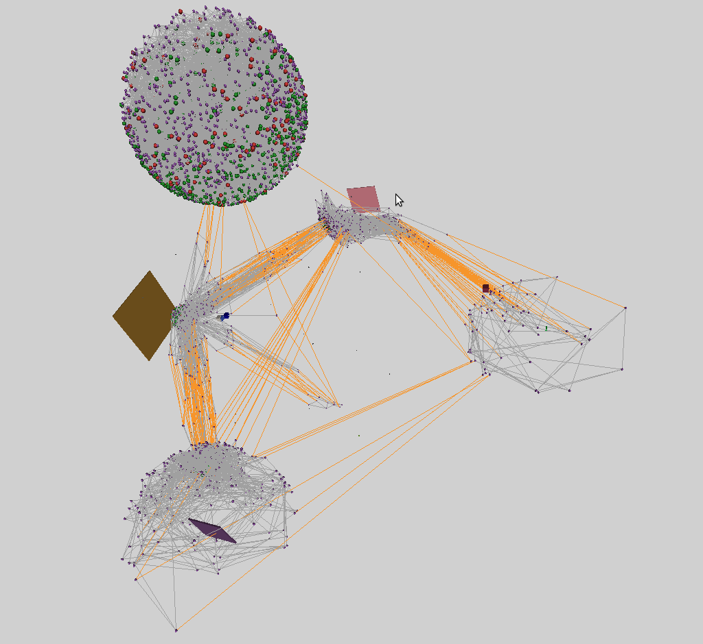
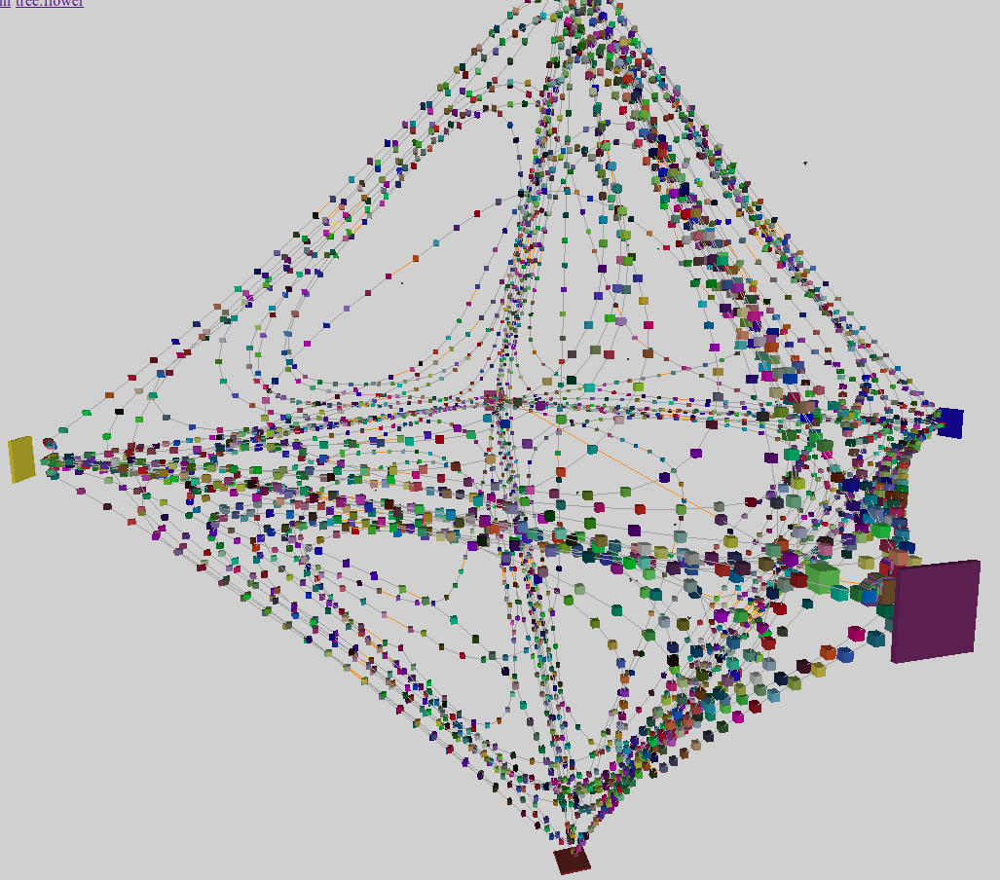
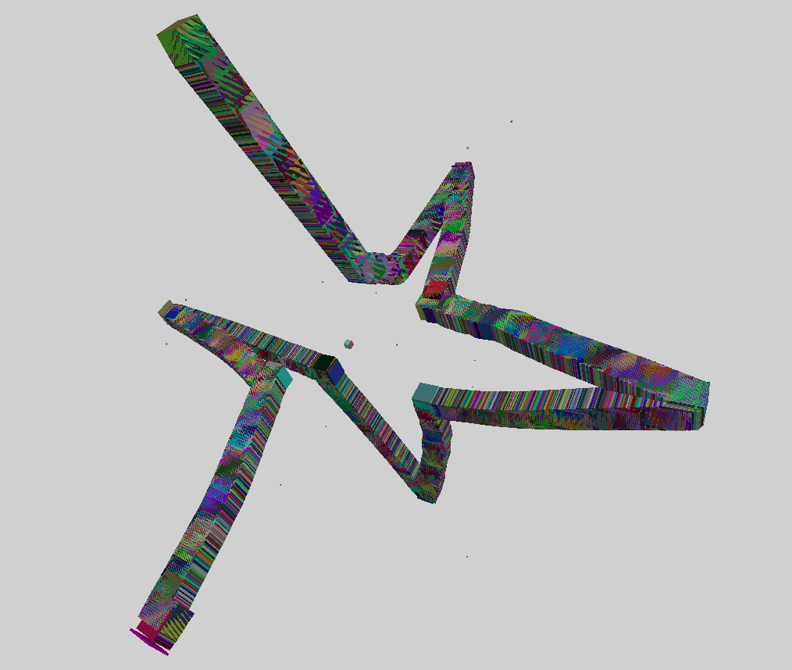

# Infoton Optimization

### Introduction

An old issue of distributed systems comes from the layered cost&latency structure of communication: Networks are slow and bandwidth-limited, whereas inter-thread communication is much faster, but still slow compared to in-thread data passing. Thus communication is often the performance bottleneck that limits scalability and needs to be optimized.

Infoton optimization is a physics-inspired model to minimize communication in message-passing distributed systems. It is essentially a decentralized, scalable version of force-directed graph drawing, aka "spring layout" [^1].

### Description

Infoton optimization is executed in a "3D Euclidean" space, where actors[^2] and schedulers (threads that execute actor code) are embedded. The central idea is that actors move close to their communication partners in the space, while distance between them approximates communication costs. This way the communication cost is minimized.

#### To move communicating actors close to each other:

B1. A so-called infoton, a force-carrying particle is attached to every message passed between actors. It is a small structure that holds the position of the source actor and a scalar "energy".

B2. When the message arrives at its destination actor, the infoton that is attached to it acts on that actor, pulling it towards the source of the message.

This is the base of infoton optimization. Now, this alone would result in all the actors concentrating around a single point, so we need at least one another force to spread the actors in the segment of the space which is "covered" with schedulers. For this:

#### To approximate communication overhead with actor distance:

E1. Schedulers are also embedded in the space, in a way that their distance represents communication overhead between them. This can be done either by static positioning or the use of network coordinates.

E2. Actors are migrated to the nearest scheduler.

E3. When a message arrives, the scheduler that executes the target actor creates a second infoton. The source of this "scheduler infoton" is the scheduler itself.

E4. This infoton either pulls or pushes the actor toward or away from the scheduler, depending on the "load" of the scheduler. The pulling/pushing behavior of the infoton is called its sign, and it is implemented as the sign of its energy field.

Mapping the state of the system - as avaiable on individual schedulers - to the signed energy of scheduler infotons is an active research area with some promising results already. Other extensions of the base are also possible.

#### Sample images


I1: A balanced binary tree of actors spreads out to fill part of the space that is covered by 6 schedulers. Green and red dots are leafs, red meaning the leaf is 90% full or more. Purple dots are inner nodes of the search tree.

---


I2: A different rendering of a scene similar to I1. Orange lines cross scheduler boundary, gray lines don't.

---


I3: A linked list of 4000 actors spreads out to fill part of the space that is covered by 6 schedulers.

---


I4: A better solution of I3, rendered sightly differently.

#### Notes

N1. The limits and applicability of this algorithm is not yet explored, implementation details are not fixed. Quoted terms in the description mark areas of uncertainty.

N2. The cost of this optimization is a small, constant overhead on every message sent, plus the overhead of actor migration.

N3. Actors cannot collide in the base model and in the extended one currently implemented in Circo. Multiple actors may be positioned at the exact same place.

N4. However, domain-specific knowledge or special requirements can be added by sending negative signal messages. E.g. If multiple copies of a piece of data exist in the system for failure tolerance, the copies can preiodically check the liveness of each other while also spread as a result.

N5. A similar domain mechanism works in the tree example, where neighbour nodes "periodically" ping each other with negative infotons.


#### Sample code

This is the current default implementation in Circo of how an infoton acts on the target actor. In this version pulling forces are not applied if the distance between the source and the target is too small. This trick seems to lead to better results in some cases. It introduces a metaparameter called `TARGET_DISTANCE`, and it can be thought of as a rudimentary approximation of a separate force that pushes actors away when they are too close.

```julia
Pos = VecE3{Float32} # 3D coordinates

struct Infoton
    sourcepos::Pos
    energy::Float32 # The sign of this field is called the sign of the Infoton
    Infoton(sourcepos::Pos, energy::Real = 1) = new(sourcepos, Float32(energy))
end

const TARGET_DISTANCE = 15.0

function apply_infoton(targetactor::Actor, infoton::Infoton)
    diff = infoton.sourcepos - targetactor.core.pos
    difflen = norm(diff)
    energy = infoton.energy
    if energy > 0 && difflen < TARGET_DISTANCE
        return nothing
    end
    targetactor.core.pos += diff / difflen * energy
    return nothing
end
```

#### How to start research on Infoton optimization

You can overload `apply_infoton` and `scheduler_infoton` for your actor types. Actor positioning is implemented as a plugin. All you need to do is to install the system and run the examples where you can tweak the current rudimentary implementation. Please share your findings on Discourse!


[^2]: For simplicity, here I use the actor model to describe the algorithm, but it can be adapted to other concurrency models.

[^1]: [Force-directed graph drawing in Wikipedia](https://en.wikipedia.org/wiki/Force-directed_graph_drawing)
