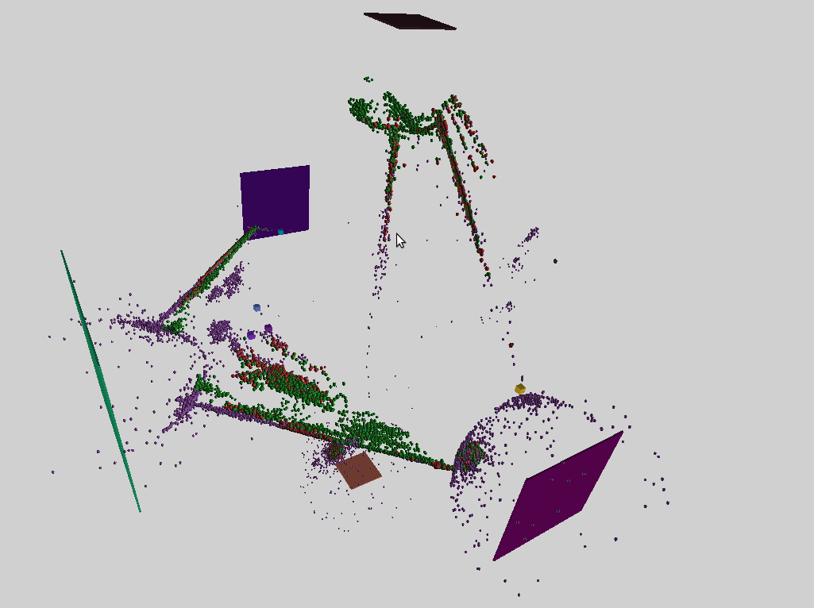

# Infoton Optimization

#### Introduction

An old issue of distributed systems comes from the layered cost and latency structure of communication: Networks are slow and bandwidth-limited, whereas inter-thread communication is much faster, but still slow compared to in-thread data passing. Thus communication is often the performance bottleneck that limits scalability and needs to be optimized.

Infoton optimization tries to minimize communication by using a physics-inspired model. It is essentially a decentralized, scalable version of force-directed graph drawing, aka "spring layout" [^1].

#### Description

Infoton optimization is executed in a "3D Euclidean" space, where actors[^2] and schedulers (threads that execute actor code) are embedded. The central idea is that actors move close to their communication partners in the Euclidean space, while distance between them approximates communication costs. This way the communication cost is minimized.

To approximate communication overhead with actor distance:

1. Schedulers are also embedded in the space, in a way that their distance represents communication overhead between them. This can be done either by static positioning or the use of network coordinates.

2. Actors are migrated to the nearest scheduler.

To move communicating actors close to each other:

1. A so-called infoton, a force-carrying particle is attached to every message passed between actors. It is a small structure that holds the position of the source actor and a scalar "energy".

2. When the message arrives at its destination actor, the infoton that is attached to it acts on that actor, pulling it towards the source of the message.

This would result in all the actors concentrating around a single point, so we need at least one another force to spread the actors in the segment of the space which is "covered" with schedulers. For this:

1. When a message arrives, the scheduler that executes the target actor creates a second infoton. The source of this infoton is the scheduler itself.

2. This infoton either pulls or pushes the actor toward or away from the scheduler, depending on the "load" of the scheduler. The pulling/pushing behavior of the infoton is called its sign, and it is implemented as the sign of its energy field.

#### Sample images




#### Notes

1. The limits and applicability of this algorithm is not yet explored, implementation details are not fixed. Quoted terms in the description mark areas of uncertainty.

2. The cost of this optimization is a small, constant overhead on every message sent, plus the overhead of actor migration. Actor count is irrelevant, as inactive actors are not optimized.

3. Actors cannot collide in this model. They may be positioned at the exact same place.

4. However, infotons attached to messages also can have a negative sign to push away the destination actor instead of pulling it. This can be used to introduce domain-specific knowledge or special requirements into the model. E.g. If multiple copies of a piece of data exist in the system for failure tolerance,  the copies can preiodically check the liveness of each other while also spread as a result.

#### Sample codes (Julia)

This is the current default implementation in Circo of how an infoton acts on the target actor. In this version pulling forces are not applied if the distance between the source and the target is too small. This trick seems to lead to better results in some cases. It introduces a parameter called `TARGET_DISTANCE`, and it can be thought of as a rudimentary approximation of a separate force that pushes actors away when they are too close.

```julia
Pos = VecE3{Float32} # 3D coordinates

struct Infoton
    sourcepos::Pos
    energy::Float32 # The sign of this field is called the sign of the Infoton
    Infoton(sourcepos::Pos, energy::Real = 1) = new(sourcepos, Float32(energy))
end

const TARGET_DISTANCE = 15.0

function apply_infoton(targetactor::AbstractActor, infoton::Infoton)
    diff = infoton.sourcepos - targetactor.core.pos
    difflen = norm(diff)
    energy = infoton.energy
    if energy > 0 && difflen < TARGET_DISTANCE
        return nothing
    end
    targetactor.core.pos += diff / difflen * energy
    return nothing
end
```


[^2]: For simplicity, here I use the actor model to describe the algorithm, but it can be adapted to other concurrency models.

[^1]: [Force-directed graph drawing in Wikipedia](https://en.wikipedia.org/wiki/Force-directed_graph_drawing)