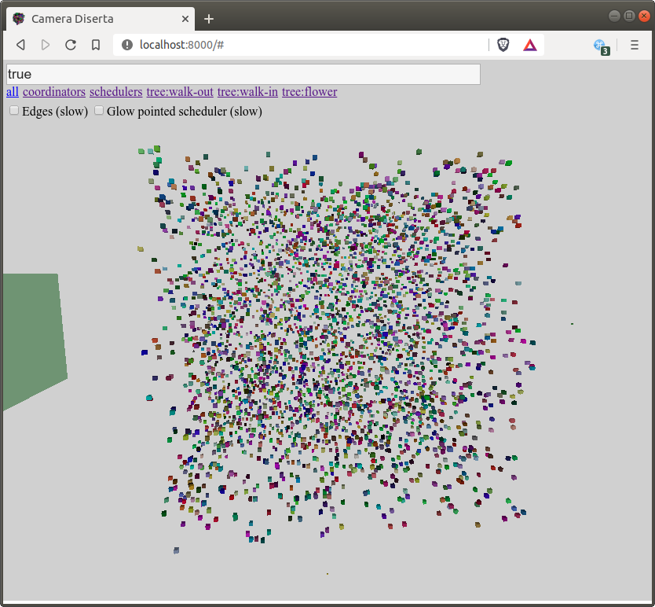
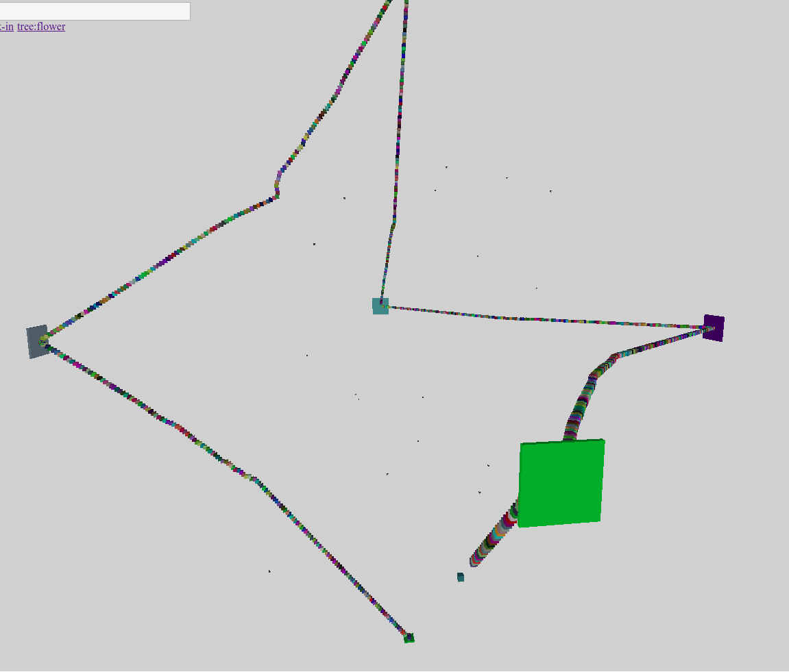

# Tutorial

When you install & run the system, on [http://localhost:8000](http://localhost:8000) soon you will see something like the following:

This is the tool "Camera Diserta" monitoring the default example:
A linked list of 4000 actors, that - when started - will calculate the sum of the list repeatedly.

6 schedulers are available, but initially all the actors are scheduled on the same one. They will migrate
to the other schedulers automatically. Actors are placed in a 3D space randomly - 3D isn't just a fancy
visualization trick, but an important element of infoton optimization.

To try out the example, you have to send a "Run" message to the test coordinator:

- Click "coordinators" in the upper left corner to filter only the test coordinator
- Click the coordinator to select it
- The commands accepted by the coordinator will be queried from it
- Click "Run" when it appears
- Click "all" to see all the actors again
- Wait for the magic to happen
- Check the logs of the backend to see the speedup

After a while Camera Diserta will display something like the following:

Large cuboids are the schedulers (size indicates the number of actors they execute), small cubes packed together
are list item actors. Actors are scheduled on the scheduler that is closest in the 3D space.

As you can see, Circo's infoton optimization found out the structure of the list without using any "domain" knowledge,
just by monitoring the communication of actors. It was also able to cut the list into 6 similarly sized segments (5 V-shaped and an I-shaped at the end of the list (bottom)). This solution minimizes the communication between schedulers.

The source code of the sample is at [examples/linkedlist.jl](https://github.com/Circo-dev/Circo/blob/master/examples/linkedlist.jl).
